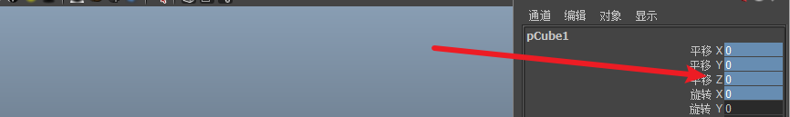

## 快捷键

1. Ctrl + A  调出通道盒
2. Shift 加选 Ctrl 减选
3. q 选择 w 移动 e旋转 r缩放
4. 通道盒

选中对应功能之后按鼠标中键拖动

拖动随便改一个即可全部更改

5. f聚焦 ，a恢复位置
6. 按住d键拖动中心方块即可选中轴心点
7. 重置中心点   修改->重置变换

8. shift + z反撤销，撤销之后才能用
9. 1-7键物体显示模式     4键显示边框 5键显示实体
10. 按住右键编辑物体显示模式
11. 在顶点模式下按住w键可以移动点
12. 顶点模式、边模式、面模式改变物体形状，对象模式改变物体位置
13. 选中物体，按Ctrl + d键拖动即可复制物体

p8 05:00
